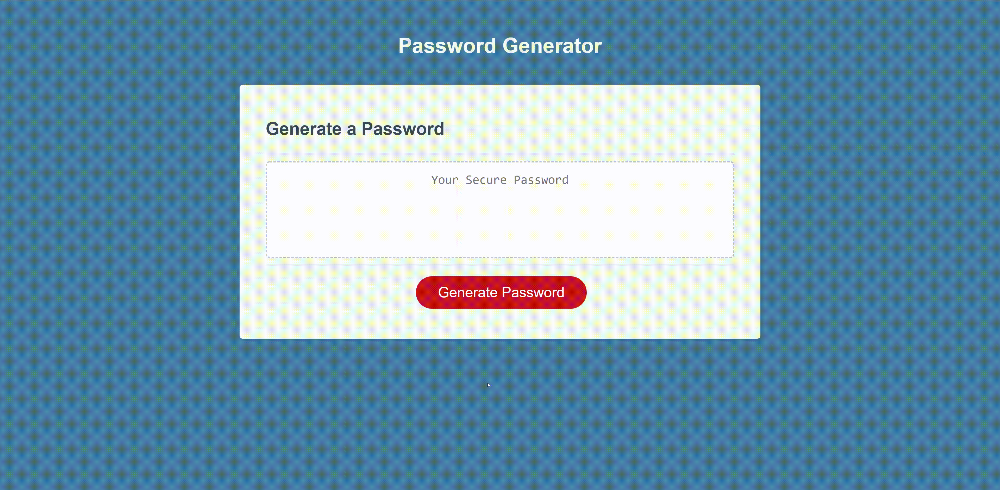

# Secure Password Generator

## Description

A secure password generator created as part of a homework assignment. The generator will randomly generate a password between 8 and 128 characters long. The user can select whether or not to include lowercase, uppercase, numeric, and/or special characters.

**Password options:**

- Password length between 8 and 128 characters
- Lowercase characters
- Uppercase characters
- Numeric characters
- Special characters

## Animated Screenshot

## Link to deployment

https://oli-drew.github.io/secure-password-generator-using-javascript-for-bootcamp-hw3/
